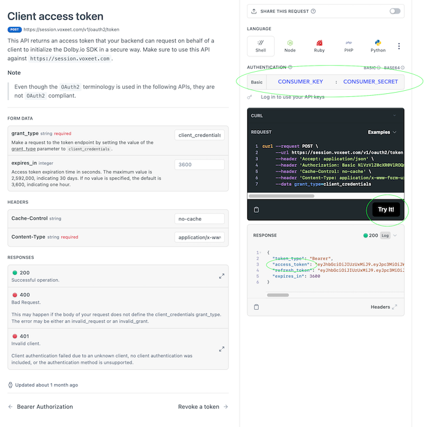

# Dolby.io Communications APIs Android SDK Java Quick Start App

This Quick Start Application is a simple audio and video conference example using the Dolby.io Communications API. You'll need to [Sign Up for a Dolby.io](https://www.dolby.io/signup) account to run the app.

## Build and Run
We'll create and use a Developer Token while in development, and recommend you use a token service for production deployment.

1. Download or clone the app and open with Android Studio.
2. Open Constants.java and if missing, replace the API_TOKEN with your developer token. You'll need to create an Auth2 token, this token can be created by going to the [Dolby.io Application Summary page](https://dashboard.dolby.io/) selecting an app, clicking on the API keys link, then copying your application's API Consumer Key and Consumer secret somewhere convenient. Next go to our [REST API documentation](https://docs.dolby.io/communications-apis/reference/get-client-access-token) and follow the instructions to create the client access token using the code example tool.
   


``` Note, for the API tool, you should provide the Consumer Key for the username and Consumer Secret for the password in the tool.```

Alternatively, you can create a **Developer Token** with the handy [bookmarklet](https://developer-token-dolbyio.netlify.app) to create a 48 hour token within your Chrome browser.

3. Build and run your application.
4. You can test the app with another participant by going to the developer dashboard at https://dashboard.dolby.io/dashboard/applications/summary and selecting your app and the **Communications APIs** link in the sidebar, select the test tab and join a conference.

### Notes:
- The Dolby.io Communications API SDK is currently VoxeetSDK.

You can find additional reference documentation here:
- [Android Reference](https://docs.dolby.io/communications/docs/android-client-sdk-voxeetsdk)
